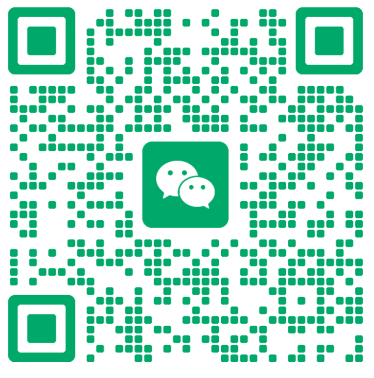

  <a href="./README.md">English</a> | <a href="./README.zh-CN.md">中文</a>

# Hi there 👋

I am an undergraduate student majoring in Computer Science and Technology. My current focus is on AI full-stack development, AI agent applications, data visualization, and engineering-oriented project implementation.

I hope to turn technology into products that can be truly used, rather than keeping it only at the code implementation level. I care about the complete development process, including requirement analysis, frontend interaction, backend services, model integration, data processing, and project deployment. I am also continuously improving my engineering capabilities and project presentation skills.

## About Me

- Undergraduate student majoring in Computer Science and Technology
- Focused on AI full-stack development, AI agents, data visualization, and developer tools
- Familiar with programming languages such as Python, JavaScript, and C++
- Familiar with frontend technologies such as React, Vue, Vite, and Three.js
- Experienced with PyTorch, OpenCV, LLM API integration, and AI agent workflows
- Familiar with common engineering tools such as Git, Docker, and Linux
- Continuously learning AI application deployment, AI agent development, and engineering practices

## Technical Skills

### Programming Languages

Python, JavaScript, C++, SQL

### Frontend Development

React, Vue, TypeScript, Vite, Three.js

### Backend & Engineering

Flask, FastAPI, Linux, Docker, Git, API Design, Project Deployment

### AI & Data Processing

PyTorch, OpenCV, LLM API Integration, AI Agent Development, Data Processing, Data Visualization

### Development Tools

GitHub, VS Code, Cursor, Codex, Windows, Linux

## Featured Projects

### [BLCU Campus Digital Human](https://github.com/xuxu69435-glitch/blcu-digital-human)

This is a campus digital human demonstration platform designed for admissions consultation, new-student guidance, and on-campus information services. The project combines large language model dialogue, speech synthesis, speech recognition, and avatar video state control to provide an interactive digital human experience.

Key points:

- Campus consultation and guidance scenarios
- Vue 3, Pinia, and Vite frontend development
- Large language model API integration and dialogue management
- Speech synthesis, speech recognition, and avatar state transitions
- Vitest-based testing, production authentication, build, and deployment workflows

### [Chinese Digit Speech Recognition](https://github.com/xuxu69435-glitch/chinese-digit-speech-recognition)

This is a PyTorch-based speech recognition learning project designed to recognize sequences of spoken Chinese digits. The project constructs training data by randomly concatenating single-digit audio files and trains a sequence-to-sequence model to predict digit sequences.

Key points:

- Audio data loading and preprocessing
- Chinese digit speech sequence construction
- Deep learning model training and inference
- Training result evaluation and visualization
- Project structure organization and GitHub release

### [RepoInsight Agent](https://github.com/xuxu69435-glitch/repoinsight-agent)

This is a tool-oriented project for repository analysis. It aims to help developers quickly understand project structure, inspect the runtime environment, analyze code issues, and generate readable reports.

Key points:

- Project directory structure analysis
- File reading and code search
- Environment checking and diagnostics
- Report generation with output protection
- Command-line tool design

### [AI Coding Guardrails Skill](https://github.com/xuxu69435-glitch/ai-coding-guardrails-skill)

A lightweight AI coding skill designed to guide AI coding assistants to make minimal, scoped, explicit, and verifiable code changes. The project focuses on improving AI-assisted development workflows by reducing unnecessary refactoring, hidden assumptions, over-engineering, and hard-to-review diffs.

Key points:

- Clear assumptions before implementation
- Minimal and focused code changes
- Avoidance of unrelated refactoring and over-engineering
- Verifiable goals and success criteria
- Practical guidance for AI coding tools such as ChatGPT, Claude, Cursor, Windsurf, and Claude Code

### [Local Study Helper Agent](https://github.com/xuxu69435-glitch/agent-study)

This is a local AI agent project designed for learning scenarios. It supports study question analysis, webpage content reading, and answer checking. The project explores how to combine large language models with local tool calling, enabling the agent to answer questions while also reading and processing real content.

Key points:

- Study question classification
- Webpage content reading
- Local tool calling
- Answer checking and feedback
- AI agent workflow design

## Areas of Interest

I am currently most interested in combining AI capabilities with real-world application scenarios, including:

- AI full-stack applications
- Local tool-based AI agents
- Small practical tools for general users
- Data visualization and scientific software
- Developer productivity tools
- Deployable, demonstrable, and maintainable projects

## Contact Me

- Email: a133870xx@163.com / xuxu69435@gmail.com
- GitHub: https://github.com/xuxu69435-glitch
- WeChat: Scan the QR code below

## I hope to keep building small, practical, complete, runnable, and truly useful projects.